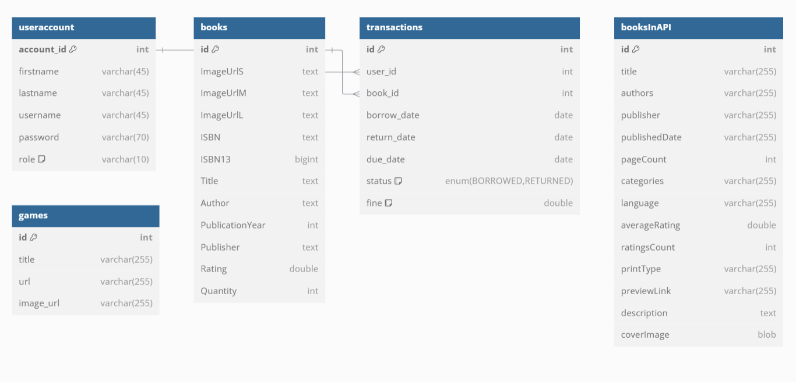
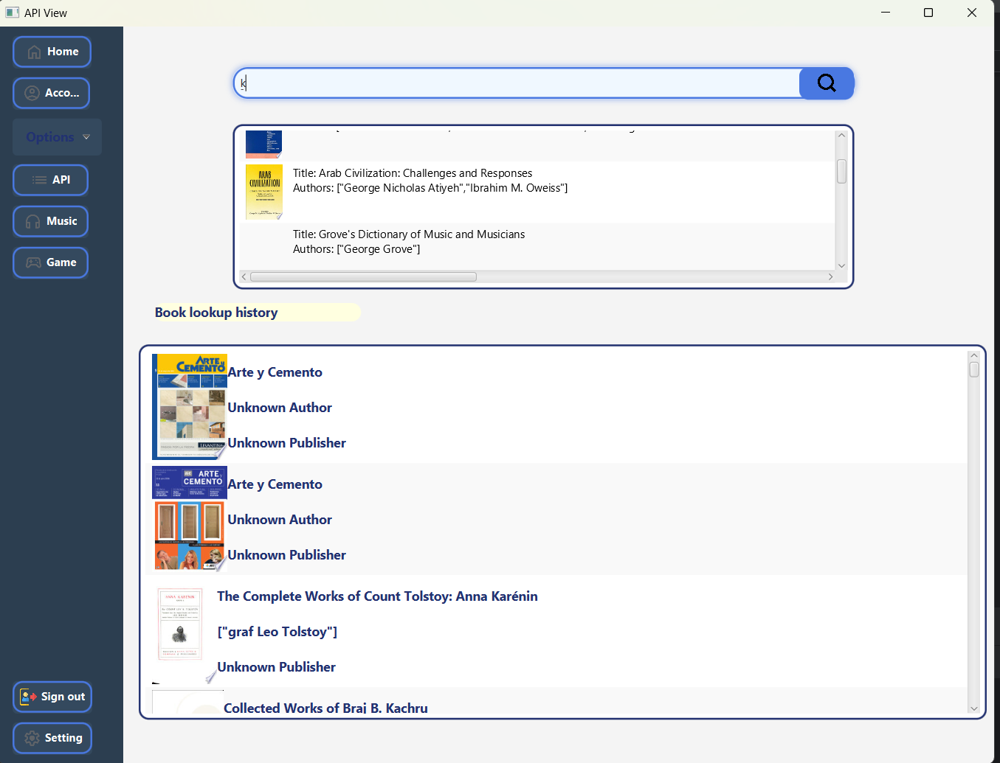
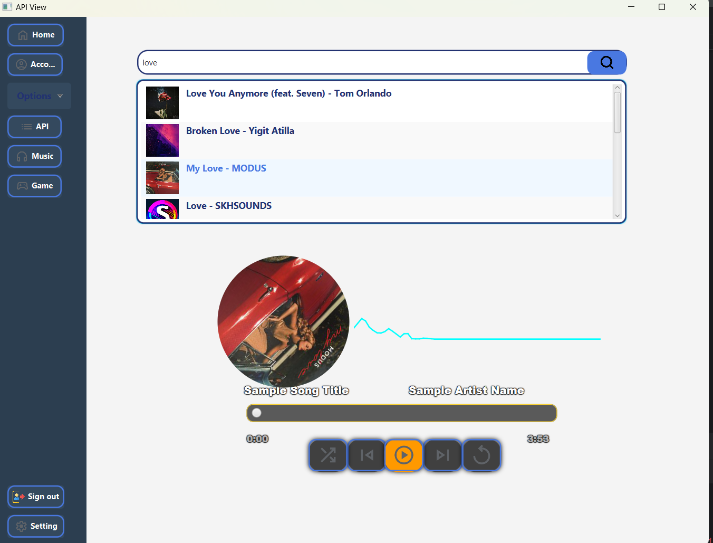
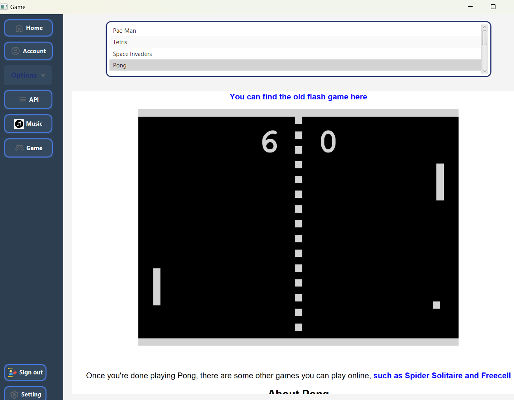

# LIBRARY MANAGEMENT SYSTEM

Bài tập lớn: Hệ thống quản lí thư viện

Lớp: 2425I_INT2204_17

## Authors

| Student ID | Full Name         | GitHub Profile                             |
|:----------:|:------------------|:-------------------------------------------|
|  23021696  | Phạm Anh Tiến     | <https://github.com/PhamAnhTienn>          |
|  23021740  | Cao Vũ Nhật Triều | <https://github.com/cvntrieu>              |
|  23021652  | Đoàn Khánh Nhật   |  <https://github.com/nhatdoankhanh>        |

## Features

- Mượn, trả, thêm xóa sách
- Phân biệt Member và Admin
- Nhạc trong ứng dụng
- API để tìm sách
- API để tìm kiếm nhạc

## Tech Stack

- Java, JavaFX
- MySQL
- Google Books APIs
- Jamendo API
- URL các trò chơi web

## Documentation

[Google Books APIs](https://developers.google.com/books/docs/overview)
[Jamendo API](https://developer.jamendo.com/v3.0/docs)

## UML DIAGRAM

#### LIBRARY MANAGEMENT SYSTEM

#### DATABASE

## Screenshots

